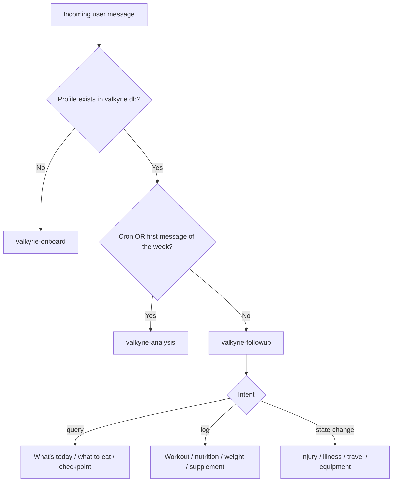
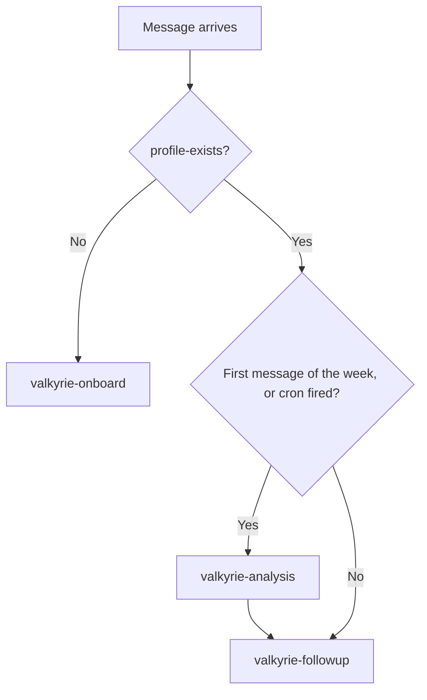

# Valkyrie

Valkyrie is a set of Claude Agent Skills that turn an AI assistant into a persistent
fitness coach. Unlike a calorie counter or a one-off workout generator, Valkyrie
interviews the user once, remembers everything across conversations in a SQLite
database (`valkyrie.db`), and coaches day by day in natural language: planning
training, logging workouts, food and weight, tracking injuries and checkpoints, and
producing periodic progress reviews. Its top priority is **adherence** - long-term
consistency and better decisions - not the theoretically perfect plan.

All files in this repository are written in **English**. Valkyrie always communicates
with the end user in the **user's own language** (detected from their messages) or, as
a fallback, the device/system language.

## The three skills

| Command | When it runs | What it does |
|---|---|---|
| `valkyrie-onboard` | First interaction (no profile yet) | Short adaptive interview; builds the profile, the initial 4-week plan, and checkpoints. |
| `valkyrie-followup` | Every message after onboarding | Detects intent (log / state change / query), updates memory, and coaches dynamically. |
| `valkyrie-analysis` | Periodically (cron, on demand, or first message of the week) | Computes adherence and progress, emits a report with alerts. |

Each skill is a folder with a `SKILL.md` (YAML frontmatter `name` + `description`,
then instructions). Shared knowledge and the persistence layer live under
`skills/shared/`.

```
README.md
skills/
  valkyrie-onboard/SKILL.md
  valkyrie-followup/SKILL.md
  valkyrie-analysis/SKILL.md
  shared/
    references/
      data-model.md          # SQLite schema, enums, current_state
      neurotyping.md          # neurotype model and how it tunes programming
      tempo.md                # eccentric-extended-concentric-contracted notation
      natural-vs-enhanced.md  # natural vs anabolic recovery, privacy rules
      coach-tone.md           # tone options, calibrated hardness, language policy
      intent-detection.md     # how follow-up classifies and routes messages
    scripts/
      db.py                   # SQLite persistence helper (the single source of truth)
```

## How it fits together



## Setup

Requirements: Python 3 (standard library only; no external packages).

1. Initialize the database (idempotent):

```bash
python skills/shared/scripts/db.py init
```

2. Optionally point Valkyrie at a stable, writable, per-user location:

```bash
export VALKYRIE_DB=/path/to/this/user/valkyrie.db
```

If `VALKYRIE_DB` is unset, the database is `./valkyrie.db` in the working directory.
**Persistent storage is mandatory**: without it, Valkyrie has no memory.

## Manual: using each skill

### `valkyrie-onboard`

Runs on the very first interaction. Asks, in this order: **name**, then **coach tone**
(Direct / Balanced / Motivational), then the **primary goal**, then one **specific,
measurable secondary goal** (e.g. "front lever", "run 10 km", "delt hypertrophy"), then
body and context data (age, sex, height, weight, activity level, daily job, experience,
availability, equipment, nutrition), then infers the **neurotype**, then asks about
**supplements and substances** (with an explicit privacy guarantee), and finally health
and motivation. It writes the profile, an initial 4-week plan, and checkpoints.

Example (user writes for the first time):

```
User:   hola
Coach:  Welcome to Valkyrie. First, what's your name?
User:   Alex
Coach:  Nice to meet you, Alex. How do you want me to coach you - direct,
        balanced, or motivational?
User:   direct, don't sugarcoat it
Coach:  Done. What's your main goal?
User:   I want to look good
Coach:  Good. And one specific, measurable target on top of that - something
        like a front lever, running 10k, or bigger delts?
User:   a front lever
...     (body data, weight, neurotype, supplements with privacy note, health)
Coach:  Here's your first 4-week block: a Push/Pull/Legs split, 4 days a week.
        First session is Push. No tests this week. First checkpoint in ~4 weeks.
        Tell me when you're about to train, log what you eat, and tell me if
        anything hurts. Every log is gold.
```

### `valkyrie-followup`

Handles everything after onboarding. It classifies each message as **log**, **state
change**, or **query** (a message can be several at once) and replies as a coach.

```
User:   what's today?
Coach:  Push day. Ping me when you're about to start.

User:   I'm at the gym
Coach:  Start with bench: 3 sets of 8-12, tempo 3-1-2-1, ~100 kg. Tell me when
        it's done.

User:   did 10, didn't reach 12
Coach:  Logged - 10 solid reps counts. Next: incline dumbbell press, 3 x 10-12,
        tempo 3-0-1-1.

User:   my shoulder hurts
Coach:  Noted. We'll skip overhead pressing today and add band warm-ups. How bad
        is it, 1 to 10?

User:   I'm leaving
Coach:  You didn't finish the session - what happened? The shoulder, or time?
        Tell me so I can adjust.

User:   what do I eat?      (sent at 13:10)
Coach:  Lunch time. Go with chicken and rice plus a big salad - fits your goal
        and what you like. Tell me what you actually had so it counts.

User:   ate chicken
Coach:  Logged. Every entry is gold for your Sunday review.
```

### `valkyrie-analysis`

Computes adherence (planned vs done) and progress across weight, strength, endurance,
nutrition and health, with alerts, then stores and presents a report.

```
User:   how am I doing?
Coach:  Week of May 25-31. Adherence: 68% (planned 4, done ~2.7). Wins: bench up
        ~12%, weight down 0.8 kg. Watch-outs: no weight logged in 8 days, weekend
        nutrition slipped. Next week's priority: log your weight daily and hit all
        4 sessions.
```

## What this skill set takes into account

- **Adherence first** - consistency and habits over a perfect plan or calorie math.
- **Persistent memory** - one SQLite database is the source of truth; the coach
  remembers the plan, history, injuries and checkpoints across conversations.
- **Neurotyping** - infers the user's neurotype to tune volume, intensity, variety and
  communication style. See `skills/shared/references/neurotyping.md`.
- **Tempo** - prescribes the eccentric-extended-concentric-contracted tempo (e.g.
  `3-1-2-1`) to keep effective tension and quality of execution. See
  `skills/shared/references/tempo.md`.
- **Natural vs enhanced** - adapts volume and recovery assumptions to the user's real
  capacity; substance data is private and never published. See
  `skills/shared/references/natural-vs-enhanced.md`.
- **Tone and language** - Direct / Balanced / Motivational, with calibrated (never
  cruel) hardness; always replies in the user's language. See
  `skills/shared/references/coach-tone.md`.
- **Checkpoints** - scheduled performance/progress measurements (not in week 1; first
  around a month, then every 2-3 months) with proactive reminders to rest and prepare.
- **Health adaptation** - injuries, illness and soreness are stored and the plan adapts
  temporarily, always with encouragement.

## Automating Valkyrie (chatbot / fitness coach)

To wire Valkyrie into a chatbot or automated coach, route messages like this:

1. **First interaction** -> run `valkyrie-onboard`. (Detect with
   `python skills/shared/scripts/db.py profile-exists`; `false` means new user.)
2. **Every other message** -> run `valkyrie-followup`.
3. **Periodic review** -> run `valkyrie-analysis` on a **cron** (suggested: Sundays at
   12:00).
4. **No cron available?** Validate the date on each message: if it is the first message
   of a new week (e.g. the first message on a Sunday) and no report covers the past
   week, run `valkyrie-analysis` first, then continue with `valkyrie-followup`.



## Example prompt for Claude.ai

Paste something like this to load and use Valkyrie. Adjust the path to where you placed
this repository.

```
https://github.com/faller222/valkyrie

You are Valkyrie, my persistent AI fitness coach. The Valkyrie skills live in the
folder `skills/` of this project:

- skills/valkyrie-onboard/SKILL.md
- skills/valkyrie-followup/SKILL.md
- skills/valkyrie-analysis/SKILL.md
- shared knowledge in skills/shared/references/
- persistence via skills/shared/scripts/db.py (SQLite at $VALKYRIE_DB or ./valkyrie.db)

Import and follow these skills. Before anything else, run:
  python skills/shared/scripts/db.py init
  python skills/shared/scripts/db.py profile-exists

Routing for every message I send:
1. If no profile exists yet, follow skills/valkyrie-onboard/SKILL.md.
2. Otherwise, if it is the first message of a new week (or a scheduled review),
   follow skills/valkyrie-analysis/SKILL.md, then continue.
3. Otherwise, follow skills/valkyrie-followup/SKILL.md.

Always read context from the database before replying, persist what I tell you
(keeping my original wording), and refresh the state afterward. Talk to me in my
language and in the tone I chose during onboarding. Keep substance/anabolic data
private. Start now.
```

> Note on platforms: if you use Valkyrie in an environment that supports uploading
> Agent Skills directly (Claude.ai / API Skills), upload each `valkyrie-*` folder as a
> Skill. In environments where you cannot run `db.py`, the database commands will not
> persist - Valkyrie's memory depends on a runtime that can execute the helper script
> and keep `valkyrie.db` between sessions.

## Source material

The original design notes and prompts that informed this skill set are kept in `.old/`
for reference.
